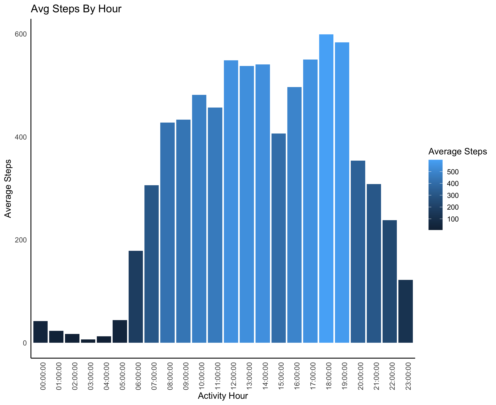
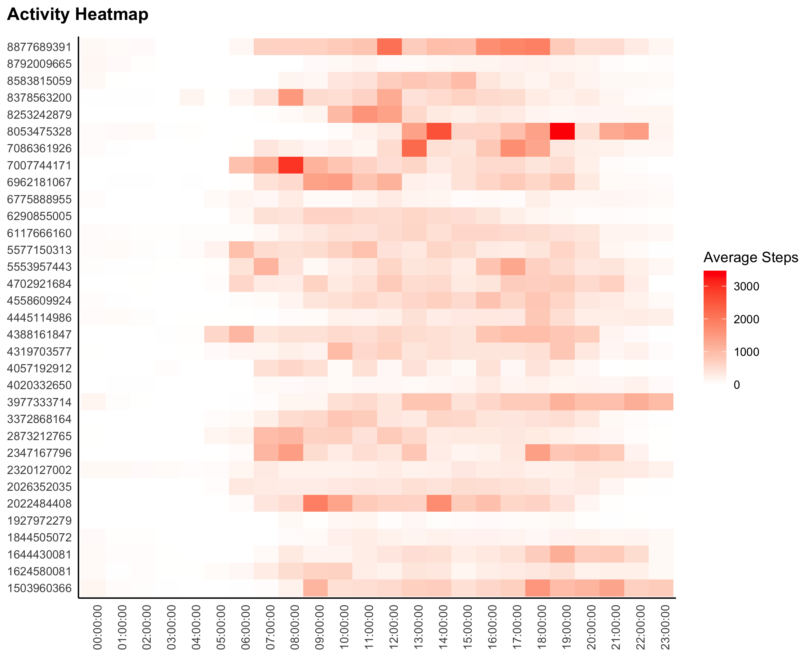

# Bellabeat Case Study Overview

#### Background

Urška Sršen and Sando Mur founded Bellabeat, a high-tech company that manufactures health-focused smart products. Sršen used her background as an artist to develop beautifully designed technology that informs and inspires women around the world. Collecting data on activity, sleep, stress, and reproductive health has allowed Bellabeat to empower women with knowledge about their own health and habits. Since it was founded in 2013, Bellabeat has grown rapidly and quickly positioned itself as a tech-driven wellness company for women.

By 2016, Bellabeat had opened offices around the world and launched multiple products. Bellabeat products became available through a growing number of online retailers in addition to their own e-commerce channel on their website. The company has invested in traditional advertising media, such as radio, out-of-home billboards, print, and television, but focuses on digital marketing extensively. Bellabeat invests year-round in Google Search, maintaining active Facebook and Instagram pages, and consistently engages consumers on Twitter. Additionally, Bellabeat runs video ads on Youtube and display ads on the Google Display Network to support campaigns around key marketing dates.

Sršen knows that an analysis of Bellabeat's available consumer data would reveal more opportunities for growth. She has asked the marketing analytics team to focus on a Bellabeat product and analyze smart device usage data in order to gain insight into how people are already using their smart devices. Then, using this information, she would like high-level recommendations for how these trends can inform Bellabeat marketing strategy.

#### Business Task

The goal of this analysis is to determine how consumers currently use non-Bellabeat smart devices, and then select one Bellabeat product to apply these insights to in my presentation to provide high-level recommendations for how these trends can inform Bellabeat's marketing strategy.

#### Questions to answer

1.  What are some trends in smart device usage?
2.  How could these trends apply to Bellabeat customers?
3.  How could these trends help influence Bellabeat marketing strategy?

#### Highlights

Here is a preview of some of the visualizations contained in this analysis. Please see the markdown document for the full analysis:

  

#### Results

1.  Only 76% of users logged activity more than 21 days during the study period, 21% logged activity between 11-20 days, and 3% (one participant), used the device less than 10 days.\
    **Marketing Strategy:** Emphasize the accessories that allow users multiple ways to wear the device, and long battery life in marketing campaigns to reassure customers that the devices are comfortable any way you wear them, and not be tethered to a charging station.

2.  The data showed that people are most active between 12:00-14:00 and 17:00-19:00 (meal times), and the highest activity tends to be at the beginning of the week and on Saturdays. Only 24% of the population achieved 30+ very active minutes per day.\
    **Marketing Strategy:** Promote the awesome benefits of the Bellabeat membership and mobile app to keep customers engaged in physical activity. Use push notifications in the app or email to encourage customers to be active during sedentary times, or recommend products that may bridge a gap in the customer's overall health score based on individualized data.

3.  Weight tracking was the area with the least participation, but people who manually logged their weight burned 7% more calories than those who did not. The participants in this study slept an average of 7 hours per night, with 7.6 hours total time in bed, however, 28% of the population did not record any sleep data. Features that are manual, complex, or difficult to use or receive feedback on are proven to be less utilized by the customer.\
    **Marketing Strategy:** Options include in-app reminders to log weight at specific intervals, or thinking bigger, potentially expand the ecosystem with a new smart fitness scale that automatically syncs with the Bellabeat app and membership service.

4.  Customer sentiment toward the Leaf is strong, however Bellabeat currently has no significant female celebrity or athlete endorsements or sponsorships to promote brand awareness.\
    **Marketing Strategy:** Bellabeat should invest in acquiring a few high profile partnerships with female celebrities or athletes who can promote the brand through their own social media followings and/or tv advertisements. To gain market share from the competition, Bellabeat must position itself as a well-trusted brand, and celebrity endorsements can be an excellent way to reach new audiences and establish trust.
